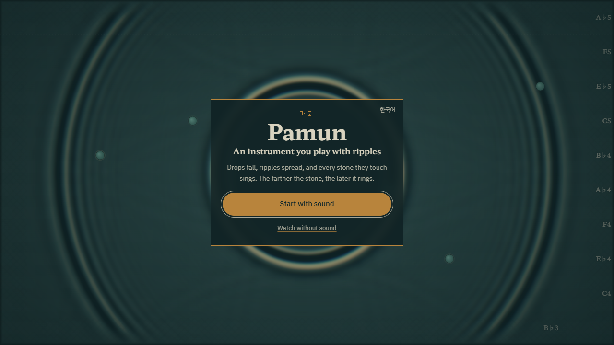

# Pamun — an instrument you play with ripples

> **Drop water. Ripples spread, and every stone they touch sings.**
> The farther the stone, the later it rings. Distance is rhythm; height is pitch.

**▶ Play it: https://jeiel85.github.io/pamun-ripple-tank/?lang=en** · [한국어](README.md)

No install — one link, desktop or phone browser. Send what you make **as a link**, or **save a 15-second clip** for Reels, Shorts or TikTok.

## How to play

1. **Start with sound** — the *drip clock* in the middle falls once per beat, and each ring plays a note the moment it reaches a stone.
2. **Drag a stone** — farther away rings later, higher up rings higher. Rhythm and melody change under your finger.
3. **Draw a wall** — ripples bounce back and come round again as echoes. Close a circle and it tells you how many beats the echo takes (the *Echo drum* preset is tuned to exactly one).
4. **Like it?** — `Share` sends a link; `Record` saves a 15-second video.

## Why it's a real instrument

It's the high-school **ripple tank** experiment. Nothing is pre-animated: the water is a wave equation solved every frame.

- Wave speed comes from water depth (shallow-water `c = √(g·d)`, about 24 cm/s at 6 mm), so **distance is time**. The plaque at the top left shows how many centimetres one beat is.
- Walls reflect, gaps diffract, and glass-covered shallows slow the ripples down and bend them. That physics is the rhythm.
- The scale is Korean court music (*Pyeongjo* pentatonic, *Hwangjong* ≈ 311.1 Hz ≈ E♭4). Lanes show Western note names in English.
- The tank has a fixed physical size, so the same layout plays the same music on every device.

## Tools

| Tool | Key | What it does |
|---|---|---|
| Drop | `1` | Tap = drop · drag = wake. Drag fast enough to break Mach 1 and you get a V-shaped cone |
| Wall | `2` | Drag to draw a wall. Closing a circle labels it with its echo in beats |
| Stone | `6` | Tap = place · drag = move · hold = remove. Height is pitch, distance from the drip clock is timing |
| Glass | `3` | Painted water gets shallower, so ripples slow down (refraction, delay) |
| Drip clock | `4` | Drips on the beat. Tap it again to cycle 1 → ½ → ⅓ → ¼ → ¾ → ⅔ beat |
| Wave maker | `5` | A continuous source. Change frequency in Controls or with `PageUp` / `PageDown` |
| Eraser | `7` | Erases walls, glass and devices |

The second finger (or right mouse button) is always **water**, whatever tool you're holding.

## Share and record

- **Share** builds a link that contains the entire tank — there is no server; the link *is* the score. Phones open the share sheet; desktops copy to the clipboard. Whoever opens it sees "Someone sent you a song made of ripples" first.
- **Record** captures the tank and its sound for up to 15 seconds: 16:9 on a landscape screen, 9:16 on a portrait phone. The clip carries the name and URL along the bottom. MP4 where the browser supports it, WebM otherwise.

## Keyboard

`Space` pause · `M` sound · `↑` `↓` depth · `←` `→` tempo · hold `Shift` to snap stones to beat rings · `B` absorbing edges · `C` calm · `G` / `W` / `P` beat rings / rain / next preset · `S`, `[` `]` strobe · `R` gesture loop · `Ctrl`/`Cmd`+`Z` undo · `Esc` close.
With the tank focused, arrow keys move a crosshair and `Enter` uses the current tool, so everything works without a mouse.

## Tech

One HTML file, no libraries: WebGL2, Canvas2D and Web Audio. Every image and sound is generated in code. A linear shallow-water solver on a 320 × 180 grid, propagation speed measured at boot, the simulation clock as the single master clock for audio, caustics through a B-spline-filtered tone LUT, and stones synthesised with free-bar modal ratios 1 : 2.756 : 5.404. Details are in the [Korean README](README.md#기술-메모) and [DECISIONS.md](DECISIONS.md).

## License

[MIT](LICENSE)
