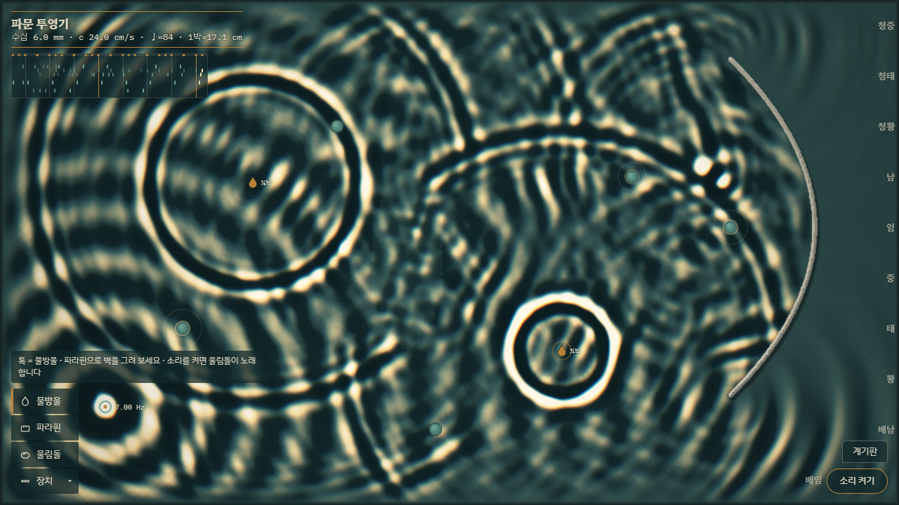
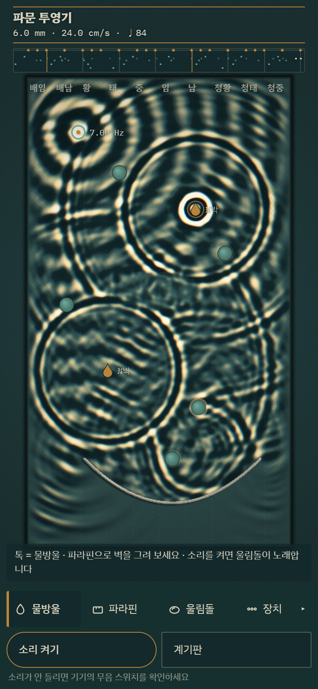

# 파문 투영기

> **물결이 가는 거리가 박자가 되고, 놓인 높이가 음정이 된다.**
> 불 끈 물리실험실의 물결통에 파라핀으로 벽을 그리고 울림돌을 놓아 연주하는 파동 악기.

**▶ 바로 열기: https://jeiel85.github.io/pamun-ripple-tank/**

설치할 것 없이 링크 하나로 PC와 모바일 브라우저에서 바로 돌아갑니다.
HTML 파일 하나에 라이브러리 없이 WebGL2 · Canvas2D · Web Audio만 씁니다. 이미지와 소리는 모두 코드로 만들고, 외부 에셋 파일은 하나도 없습니다(폰트만 Google Fonts).



## 어떤 작품인가

고교 물리 시간의 **물결통 실험(ripple tank)** 을 그대로 옮겨 왔습니다.
얕은 물 위에 점광원을 비추면, 물결의 마루는 볼록렌즈처럼 빛을 모으고 골은 빛을 퍼뜨려 바닥에 빛 그물(캐스틱)이 비칩니다. 이 작품의 화면이 바로 그 투영면입니다.

- 수조는 **64 × 36 cm**, 수심은 **6.0 mm** 입니다. 물결은 얕은 물 근사 `c = √(g·d)` 로 약 **24 cm/s** 로 퍼지고, 화면 왼쪽 위 명판에 실제 속도와 **1박 = 몇 cm** 인지가 표시됩니다.
- 물방울이 떨어지면 링이 퍼져 나가고, 링이 **울림돌** 에 닿는 순간 소리가 납니다. 점적기에서 먼 돌일수록 늦게, 그리고 여리게 울립니다. **거리가 곧 시간** 입니다.
- 울림돌의 높이(레인)가 음정입니다. 음계는 국악 율명(황·태·중·임·남…)을 쓰고, 황종은 정악 관례대로 약 311.1 Hz 로 잡았습니다.
- 파라핀 벽은 물결을 반사하고, 틈은 회절시키고, 유리판을 깐 얕은 곳은 물결을 늦춰 굴절시킵니다. 이 물리가 그대로 리듬을 바꿉니다.

소리는 기본으로 꺼져 있습니다. 오른쪽 아래 **소리 켜기** 를 누르면 울림돌이 노래합니다. 소리를 끈 채로도 울림돌의 램프빛 번쩍임과 명판 아래 **발음 스트립**(최근 두 마디의 악보)으로 리듬이 보입니다.



폰 세로 화면에서는 수조가 90° 돌아가 **오른쪽일수록 높은 음** 이 됩니다. 수조의 물리 크기가 고정이라서, 같은 배치는 어느 기기에서든 같은 음악이 됩니다.

## 도구

| 도구 | 키 | 동작 |
|---|---|---|
| 물방울 | `1` | 톡 = 물방울 · 끌기 = 물결 항적. 빠르게 끌어 마하 1을 넘기면 V자 원뿔이 생깁니다 |
| 파라핀 | `2` | 끌어서 벽을 그립니다. 원을 닫으면 `메아리 n박` 라벨이 붙습니다 |
| 울림돌 | `6` | 톡 = 놓기 · 끌기 = 옮기기 · 길게 누르기 = 치우기. 높이가 음정, 점적기와의 거리가 박자입니다 |
| 유리판 | `3` | 칠한 곳이 얕아져 물결이 느려집니다(굴절 · 지연) |
| 점적기 | `4` | 박자에 맞춰 방울을 떨어뜨립니다. 다시 톡 하면 박 나누기가 1 → ½ → ⅓ → ¼ → ¾ → ⅔ 로 바뀝니다 |
| 진동자 | `5` | 연속파를 냅니다. 주파수는 계기판이나 `PageUp` / `PageDown` 으로 바꿉니다 |
| 지우개 | `7` | 벽 · 유리 · 장치를 지웁니다 |

처음 화면에는 물방울 · 파라핀 · 울림돌만 보이고, 나머지는 **장치 ▸** 를 펼치면 나옵니다.
두 번째 손가락(또는 마우스 오른쪽 버튼)은 어떤 도구를 쓰고 있든 언제나 **물** 입니다. 벽을 그리다가도 바로 물결을 일으킬 수 있습니다.

## 키보드

| 키 | 동작 |
|---|---|
| `Space` | 멈춤 · 재개 |
| `M` | 소리 켜기 · 끄기 |
| `↑` `↓` | 수심 ±0.5 mm (물결 속도가 바뀝니다) |
| `←` `→` | 템포 ±2 BPM |
| `Shift` (누른 채) | 울림돌을 박자 링에 스냅 |
| `B` | 소파 장치(가장자리 흡수) 켜기 · 끄기 — 끄면 수조 전체가 잔향실이 됩니다 |
| `C` | 수면 잠재우기 |
| `G` / `W` / `P` | 박자 눈금 / 비 / 프리셋 순환 |
| `S`, `[` `]` | 스트로보, 스트로보 주파수 ±0.05 Hz |
| `R` | 손짓 루프 녹음(두 마디) |
| `Ctrl`/`Cmd` + `Z` | 되돌리기 |
| `Esc` | 선택 해제 · 계기판 닫기 |

수조(캔버스)에 포커스를 두면 화살표가 **조준경** 을 옮기고, `Enter` 로 현재 도구를 씁니다(`Enter` 를 누른 채 화살표 = 끌기, 550 ms 누르기 = 치우기). 마우스나 터치 없이도 모든 도구를 쓸 수 있습니다. 조준경 모드에서 수심 · 템포는 `Alt` + 화살표입니다.

## 프리셋

계기판의 **프리셋** 에서 고릅니다.

- **첫 장면** — 점적기 둘(½박 · ¾박), 7 Hz 진동자, 파라볼라 파라핀 벽, 렌즈 모양 유리판, 울림돌 다섯.
- **이중 슬릿** — 슬릿 뒤에 세로로 늘어선 울림돌들의 지속음 세기가 간섭 무늬를 따라 달라집니다.
- **메아리 북** — 반지름이 1박의 절반인 원. 가운데를 톡 하면 반사파가 박자에 맞춰 돌아옵니다.
- **속삭이는 타원** — 한 초점의 점적기가 다른 초점의 울림돌에만 악센트를 겁니다.
- **공명실** — 진동자 주파수를 방의 모드에 맞추면 공명 게이지가 치솟고 바둑판 정상파가 떠오릅니다.
- **내 수조** — 마지막으로 만든 수조가 브라우저에 자동 저장되어 있으면 나타납니다.

## 접근성 · 안전

- `prefers-reduced-motion` 이 켜져 있거나 계기판에서 **움직임 줄이기** 를 켜면 시간이 0.4배로 느려지고 대비가 낮아지며, 자동 비와 스트로보가 꺼집니다.
- 화면 전체 밝기가 크게 출렁이지 않도록 전역 대비 제한이 항상 동작합니다. 스트로보는 기본으로 꺼져 있고, 켤 때 안내가 뜨며 홀드 사이를 크로스페이드합니다.
- 소리는 버튼을 누르기 전까지 오디오 컨텍스트조차 만들지 않습니다. 동시 발음 수와 초당 타격 수에 상한이 있고, 마스터 체인에 컴프레서가 있습니다.
- WebGL2 를 쓸 수 없으면 같은 팔레트의 Canvas2D **간이 투영 모드** 로 돌아가고, GPU 컨텍스트가 사라져도 음악은 끊기지 않습니다.

## 기술 메모

- **솔버**: 선형 얕은 물 파동 방정식을 320 × 180 격자(dx = 2 mm)에서 9점 등방 라플라시안 leapfrog 로 풉니다. Courant 수를 0.55 로 고정하고, 진폭 의존 포화 감쇠 · 에너지 기반 진동자 자동 게인 · NaN 가드로 공명 상황에서도 폭주하지 않게 했습니다.
- **c_eff 실측**: 격자 분산 때문에 실제 전파 속도는 이론값보다 약간 느립니다. 부팅할 때 시험 격자에서 링이 두 거리를 지나는 시각을 재서 실제 속도를 구하고, 모든 박자 표시와 스냅에 그 값을 씁니다.
- **단일 시계**: 시뮬레이션 시간이 유일한 마스터 시계입니다. 기기가 느리면 음악 전체가 함께 느려지고(명판에 `시간 ×0.82` 처럼 표시), 소리는 시뮬레이션 시각을 오디오 시각으로 사상해 스케줄합니다.
- **투영**: 곡률과 기울기를 CPU 에서 격자 해상도로 계산해 R16F 텍스처로 올리고, 셰이더에서 B-스플라인 바이큐빅으로 펴서 5단 LUT(암실 청록 → 수면 회청 → 텅스텐)로 칠합니다. R · B 채널을 램프 방향으로 살짝 어긋나게 샘플해 미세한 색 테를 냅니다.
- **소리**: 울림돌은 자유단 막대의 비조화 모드비 1 : 2.756 : 5.404 로 합성하고, 물방울은 갇힌 기포의 민나르트 공명(`f ≈ 3.26 / R kHz`)으로 짧게 올라가는 chirp 를 냅니다. 잔향 IR 도 코드로 만듭니다.

## 만든 과정

Claude Opus 5.5 의 멀티 에이전트 워크플로로 만들었습니다.

1. **컨셉 패널** — 서로 다른 렌즈(살아있는 시스템 / 물질과 물리 / 연주하는 그림 / 구체적 세계의 한 장면)를 맡은 에이전트 4명이 컨셉을 하나씩 내고, 관점이 다른 심사위원 3명(첫인상 / 구현 가능성 / 상호작용 깊이)이 채점했습니다.
   파문 투영기 22.1 · 입김 유리창 21.1 · 돌옷 연대기 20.8 · 소금이 온다 16.2 ([채점 기록](docs/design/concept-panel.json))
2. **명세** — 우승작에 심사위원들의 필수 수정 사항과 다른 컨셉의 아이디어 3개를 녹여 [구현 명세](docs/design/SPEC.md)를 만들었습니다.
3. **구현과 리뷰** — 구현 에이전트가 명세를 바탕으로 만든 뒤, 리뷰어 3명(물리·음악 / 상호작용·레이아웃 / 렌더링·견고성)이 코드와 실행으로 검증했습니다(지적 37건 → 수정 35 · 이월 2). 이어서 회귀 위험과 유지보수성을 보는 2차 리뷰를 한 번 더 거쳤습니다(지적 18건 → 수정 16 · 이월 2). 리뷰는 매번 헤드리스 Chrome 스모크 테스트와 스크린샷 판독을 함께 했습니다.
   실측으로 수용 기준을 맞추느라 명세와 다르게 만든 곳은 [구현 편차](docs/DEVIATIONS.md)에 정리했습니다. 명세 값으로 되돌리기 전에 먼저 확인하세요.

## 알려진 한계

아직 채우지 못한 수용 기준(첫 프레임 밝기 비율, 메아리 북 4번째 메아리, 일부 캘리퍼 값)과 미뤄 둔 개선은 [BACKLOG.md](BACKLOG.md)에 근거 수치와 함께 적어 두었습니다.

## 개발

빌드 단계는 없습니다. `index.html` 을 브라우저로 열면 됩니다.

```bash
node tools/smoke.mjs
```

헤드리스 Chrome 으로 데스크톱(1280×720)과 폰(390×844, 터치) 화면을 열어 예외 · 콘솔 에러 · 가로 스크롤을 점검하고, 탭 전후의 진단 값과 스크린샷(`.smoke/`)을 남깁니다. 진단 값은 페이지가 노출하는 읽기 전용 훅 `window.__pamun.diag()` 에서 읽습니다(렌더 모드, 시간 팽창, 울림돌별 발음 횟수, 캐스틱 톤 비율 등). Node 22 이상과 Chrome(또는 Edge)이 필요하고, 브라우저 경로는 `CHROME_PATH` 로 바꿀 수 있습니다.

```bash
node tools/smoke.mjs --og docs/og.jpg
```

공유 미리보기 이미지(1200×630)를 다시 찍습니다.

```bash
node tools/smoke.mjs --shot docs/screenshot-desktop.png --size 1280x720 --wait 6000
node tools/smoke.mjs --shot docs/screenshot-phone.png --size 390x844 --mobile --wait 6000
```

README 스크린샷을 다시 찍습니다. `--mobile`을 주면 터치 · DPR 2 폰 레이아웃으로 찍습니다. 헤드리스 Chrome은 소프트웨어 GL이라 느려서, 명판에 `시간 ×0.8` 같은 시간 팽창 표시가 함께 찍힐 수 있습니다.

## 라이선스

[MIT](LICENSE)
