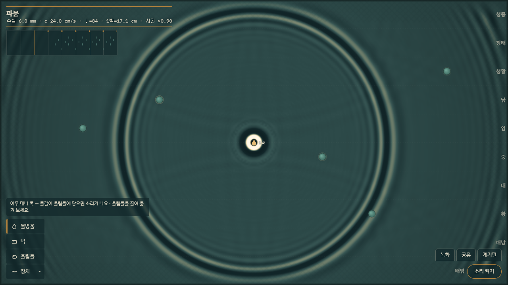
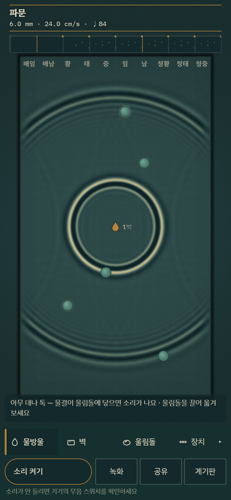

# 파문 — 물결로 연주하는 악기

> **물방울을 떨어뜨리면 물결이 퍼지고, 울림돌에 닿을 때마다 소리가 나요.**
> 멀리 있는 돌일수록 늦게 울립니다. 거리가 박자, 높이가 음정입니다.

**▶ 바로 열기: https://jeiel85.github.io/pamun-ripple-tank/** · [English](README.en.md)

설치 없이 링크 하나로 PC와 폰 브라우저에서 바로 됩니다. 만든 수조는 **링크로 보내고**, **15초 영상으로 저장**해 릴스·쇼츠에 올릴 수 있습니다.



## 이렇게 놀아요

1. **소리 켜고 시작** — 가운데 *방울 시계*가 1박마다 떨어지고, 퍼지는 물결이 울림돌에 닿는 순간마다 음이 납니다.
2. **울림돌을 끌어 옮겨 보세요** — 멀리 두면 늦게, 위로 올리면 높게 울립니다. 리듬과 멜로디가 손끝에서 바뀝니다.
3. **벽을 그려 보세요** — 물결이 벽에 튕겨 돌아오며 메아리 박자를 만듭니다. 원을 그리면 몇 박짜리 메아리인지 표시됩니다.
4. **마음에 들면** — `공유`로 링크를 보내거나 `녹화`로 15초 영상을 저장합니다.



폰 세로 화면에서는 수조가 90° 돌아가 **오른쪽일수록 높은 음** 이 됩니다. 수조 크기가 고정이라 같은 배치는 어느 기기에서든 같은 음악이 됩니다.

## 왜 '진짜' 악기인가

고교 물리 시간의 **물결통 실험(ripple tank)** 을 그대로 옮겼습니다. 물결은 미리 짠 애니메이션이 아니라 매 순간 파동 방정식으로 계산됩니다.

- 물결 속도는 수심으로 정해집니다(얕은 물 근사 `c = √(g·d)`, 기본 6 mm에서 약 24 cm/s). 그래서 **거리가 곧 시간** 이고, 화면 왼쪽 위 명판에 `1박 = 몇 cm` 가 표시됩니다.
- 벽은 물결을 반사하고, 틈은 회절시키고, 유리판을 깐 얕은 곳은 물결을 늦춰 굴절시킵니다. 이 물리가 그대로 리듬을 바꿉니다.
- 음계는 국악 율명(황·태·중·임·남…)을 씁니다. 황종은 정악 관례대로 약 311.1 Hz(≈ E♭4)입니다. 영어 화면에서는 서양 음이름으로 보입니다.

## 도구

| 도구 | 키 | 동작 |
|---|---|---|
| 물방울 | `1` | 톡 = 물방울 · 끌기 = 물결 항적. 빠르게 끌어 마하 1을 넘기면 V자 원뿔이 생깁니다 |
| 벽 | `2` | 끌어서 벽(파라핀)을 그립니다. 원을 닫으면 `메아리 n박` 라벨이 붙습니다 |
| 울림돌 | `6` | 톡 = 놓기 · 끌기 = 옮기기 · 길게 누르기 = 치우기. 높이가 음정, 방울 시계와의 거리가 박자입니다 |
| 유리판 | `3` | 칠한 곳이 얕아져 물결이 느려집니다(굴절 · 지연) |
| 방울 시계 | `4` | 박자에 맞춰 방울을 떨어뜨립니다. 다시 톡 하면 박 나누기가 1 → ½ → ⅓ → ¼ → ¾ → ⅔ 로 바뀝니다 |
| 진동자 | `5` | 연속파를 냅니다. 주파수는 계기판이나 `PageUp` / `PageDown` 으로 바꿉니다 |
| 지우개 | `7` | 벽 · 유리 · 장치를 지웁니다 |

처음 화면에는 물방울 · 벽 · 울림돌만 보이고, 나머지는 **장치 ▸** 를 펼치면 나옵니다.
두 번째 손가락(또는 마우스 오른쪽 버튼)은 어떤 도구를 쓰고 있든 언제나 **물** 입니다.

## 공유와 녹화

- **공유** — 지금 수조 배치가 통째로 들어간 링크를 만듭니다(서버 없음, 링크 자체가 악보). 폰에서는 공유 시트가, PC에서는 클립보드 복사가 열립니다. 받은 사람에게는 "누군가 물결로 만든 곡을 보냈어요" 카드가 먼저 뜹니다.
- **녹화** — 수조 영역의 화면과 소리를 최대 15초 영상으로 담습니다. PC 가로 화면은 16:9, 폰 세로 화면은 9:16이라 릴스 · 쇼츠 · 틱톡 비율에 맞습니다. 영상 아래에는 이름과 주소가 들어갑니다. 브라우저가 지원하면 MP4로, 아니면 WebM으로 저장됩니다.

## 키보드

| 키 | 동작 |
|---|---|
| `Space` | 멈춤 · 재개 |
| `M` | 소리 켜기 · 끄기 |
| `↑` `↓` | 수심 ±0.5 mm (물결 속도가 바뀝니다) |
| `←` `→` | 템포 ±2 BPM |
| `Shift` (누른 채) | 울림돌을 박자 링에 스냅 |
| `B` | 가장자리 흡수 켜기 · 끄기 — 끄면 수조 전체가 잔향실이 됩니다 |
| `C` | 수면 잠재우기 |
| `G` / `W` / `P` | 박자 눈금 / 비 / 프리셋 순환 |
| `S`, `[` `]` | 스트로보, 스트로보 주파수 ±0.05 Hz |
| `R` | 손짓 루프 녹음(두 마디) |
| `Ctrl`/`Cmd` + `Z` | 되돌리기 |
| `Esc` | 첫 화면 카드 · 시트 닫기, 선택 해제, 계기판 닫기 |

수조(캔버스)에 포커스를 두면 화살표가 **조준경** 을 옮기고, `Enter` 로 현재 도구를 씁니다(`Enter` 를 누른 채 화살표 = 끌기, 550 ms 누르기 = 치우기). 조준경 모드에서 수심 · 템포는 `Alt` + 화살표입니다.

## 프리셋

계기판의 **프리셋** 에서 고릅니다.

- **오르골** (첫 화면) — 가운데 1박 방울 시계와, ¼박 거리씩 떨어진 울림돌 다섯. 매 박 같은 아르페지오가 되풀이됩니다.
- **물리 실험실** — 방울 시계 둘(½박 · ¾박), 7 Hz 진동자, 포물선 벽, 렌즈 모양 유리판, 울림돌 다섯. 화면이 가장 화려합니다.
- **이중 슬릿** — 슬릿 뒤 울림돌들의 지속음 세기가 간섭 무늬를 따라 달라집니다.
- **메아리 북** — 반지름이 1박의 절반인 원. 가운데를 톡 하면 반사파가 박자에 맞춰 돌아옵니다.
- **속삭이는 타원** — 한 초점의 방울 시계가 다른 초점의 울림돌에만 악센트를 겁니다.
- **공명실** — 진동자 주파수를 방의 모드에 맞추면 공명 게이지가 치솟고 바둑판 정상파가 떠오릅니다.
- **내 수조** / **받은 수조** — 마지막으로 만든 수조(브라우저에 자동 저장)와 공유 링크로 받은 수조.

## 언어

브라우저 언어가 한국어면 한국어, 아니면 영어로 열립니다. 첫 화면 카드 오른쪽 위나 계기판 **언어 · Language** 에서 바꿀 수 있고, 주소에 `?lang=en` / `?lang=ko` 를 붙여 고정할 수도 있습니다.

## 접근성 · 안전

- 소리는 사용자가 **소리 켜고 시작** · **소리 켜기** · **녹화** 를 누르기 전까지 오디오 컨텍스트조차 만들지 않습니다. 동시 발음 수와 초당 타격 수에 상한이 있고, 마스터 체인에 컴프레서가 있습니다.
- `prefers-reduced-motion` 이 켜져 있거나 계기판에서 **움직임 줄이기** 를 켜면 시간이 0.4배로 느려지고 대비가 낮아지며, 자동 비와 스트로보가 꺼집니다.
- 화면 전체 밝기가 크게 출렁이지 않도록 전역 대비 제한이 항상 동작합니다. 스트로보는 기본으로 꺼져 있고, 켤 때 안내가 뜨며 홀드 사이를 크로스페이드합니다.
- WebGL2 를 쓸 수 없으면 같은 팔레트의 Canvas2D **간이 투영 모드** 로 돌아가고, GPU 컨텍스트가 사라져도 음악은 끊기지 않습니다.
- 받은 공유 링크는 남이 만든 입력으로 보고 길이 · 풀린 크기 · 자료형 · 개수 상한을 모두 검사합니다.

## 기술 메모

HTML 파일 하나에 라이브러리 없이 WebGL2 · Canvas2D · Web Audio만 씁니다. 이미지와 소리는 모두 코드로 만들고 외부 에셋은 없습니다(폰트만 Google Fonts).

- **솔버**: 선형 얕은 물 파동 방정식을 320 × 180 격자(dx = 2 mm)에서 9점 등방 라플라시안 leapfrog 로 풉니다. 진폭 의존 포화 감쇠 · 에너지 기반 진동자 자동 게인 · NaN 가드로 공명 상황에서도 폭주하지 않게 했습니다.
- **c_eff 실측**: 격자 분산 때문에 실제 전파 속도는 이론값보다 약간 느립니다. 부팅할 때 시험 격자에서 실제 속도를 재고, 모든 박자 표시 · 스냅 · 오르골 배치에 그 값을 씁니다.
- **단일 시계**: 시뮬레이션 시간이 유일한 마스터 시계입니다. 기기가 느리면 음악 전체가 함께 느려지고(명판에 `시간 ×0.82` 처럼 표시), 소리는 시뮬레이션 시각을 오디오 시각으로 사상해 스케줄합니다.
- **투영**: 곡률과 기울기를 격자 해상도로 계산해 R16F 텍스처로 올리고, 셰이더에서 B-스플라인 바이큐빅으로 펴서 5단 LUT(암실 청록 → 수면 회청 → 텅스텐)로 칠합니다.
- **소리**: 울림돌은 자유단 막대의 비조화 모드비 1 : 2.756 : 5.404 로 합성하고, 물방울은 갇힌 기포의 민나르트 공명(`f ≈ 3.26 / R kHz`)으로 짧게 올라가는 chirp 를 냅니다.
- **공유 링크**: 배치를 0.1 cm 정수 · 차분으로 줄인 JSON을 `deflate-raw` 로 압축해 URL 조각(`#t=`)에 담습니다. 기본 수조는 약 130자입니다. 형식은 [DECISIONS.md](DECISIONS.md)에 있습니다.
- **녹화**: 렌더 직후 같은 프레임 안에서 수조 영역을 녹화용 캔버스로 복사하고(`captureStream`), 마스터 체인 끝을 `MediaStreamDestination` 에도 이어 `MediaRecorder` 로 담습니다.

## 만든 과정

Claude Opus 5.5 의 멀티 에이전트 워크플로로 만들었습니다.

1. **컨셉 패널** — 서로 다른 렌즈를 맡은 에이전트 4명이 컨셉을 하나씩 내고, 관점이 다른 심사위원 3명이 채점했습니다([채점 기록](docs/design/concept-panel.json)).
2. **명세** — 우승작에 심사위원들의 필수 수정 사항을 녹여 [구현 명세](docs/design/SPEC.md)를 만들었습니다.
3. **구현과 리뷰** — 구현 뒤 리뷰어 3명이 코드와 실행으로 검증했습니다(1차 지적 37건 → 수정 35 · 이월 2, 2차 18건 → 수정 16 · 이월 2).
4. **정체성 다듬기** — '물리 실험 장치'보다 '물결로 연주하는 악기'로 정체성을 좁히고, 첫 화면 · 공유 링크 · 영상 녹화 · 영어를 더했습니다([결정 기록](DECISIONS.md)).

명세와 다르게 만든 곳은 [구현 편차](docs/DEVIATIONS.md)에, 아직 채우지 못한 수용 기준과 미뤄 둔 개선은 [BACKLOG.md](BACKLOG.md)에 있습니다.

## 개발

빌드 단계는 없습니다. `index.html` 을 브라우저로 열면 됩니다.

```bash
node tools/smoke.mjs
```

헤드리스 Chrome 으로 데스크톱(1280×720), 폰(390×844, 터치), 영어 데스크톱을 열어 예외 · 콘솔 에러 · 가로 스크롤을 점검하고, 첫 화면 카드 · 공유 링크 왕복 · 클립 녹화 · 영어 화면에 남은 한글을 확인합니다. 진단 값은 읽기 전용 훅 `window.__pamun.diag()` 에서 읽습니다. Node 22 이상과 Chrome(또는 Edge)이 필요하고, 브라우저 경로는 `CHROME_PATH` 로 바꿀 수 있습니다.

```bash
node tools/smoke.mjs --og docs/og.jpg
```

공유 미리보기 이미지(1200×630, 첫 화면 카드 포함)를 다시 찍습니다.

```bash
node tools/smoke.mjs --shot docs/screenshot-desktop.png --size 1280x720 --dismiss --wait 6000
node tools/smoke.mjs --shot docs/screenshot-phone.png --size 390x844 --mobile --dismiss --wait 6000
node tools/smoke.mjs --shot docs/screenshot-en.png --size 1280x720 --query "?lang=en"
```

README 스크린샷을 다시 찍습니다. `--dismiss` 는 첫 화면 카드를 닫고, `--query` 는 주소 뒤에 붙일 문자열입니다. 헤드리스 Chrome은 소프트웨어 GL이라 느려서 명판에 `시간 ×0.8` 같은 표시가 함께 찍힐 수 있습니다.

## 라이선스

[MIT](LICENSE)
